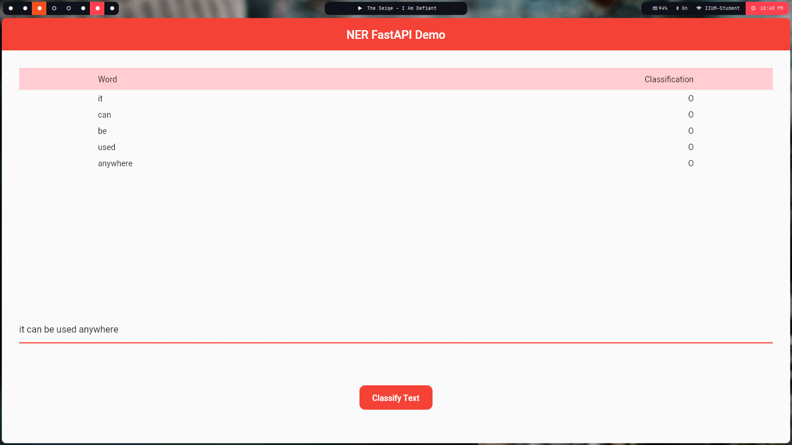

# ner_fastapi_flutter

A flutter application for my [Named Entity Recognition API](https://github.com/Blacksuan19/NER-FastAPI/) hosted on heroku.

- Riverpod for state management.
- handle all possible cases (word not in index, server down, etc...).

## Directory structure

<pre>
lib
├── api.dart
├── main.dart
├── screens
│   └── home.dart
└── widgets
    ├── api_widgets.dart
    └── material_button.dart
</pre>

## Screenshots

